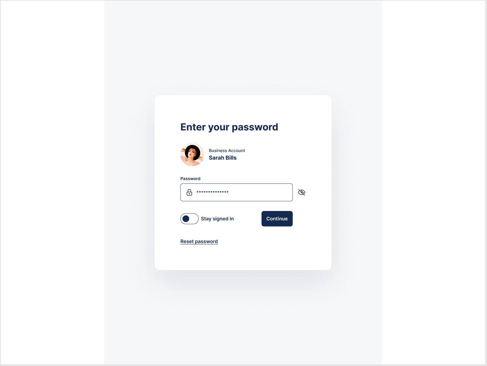
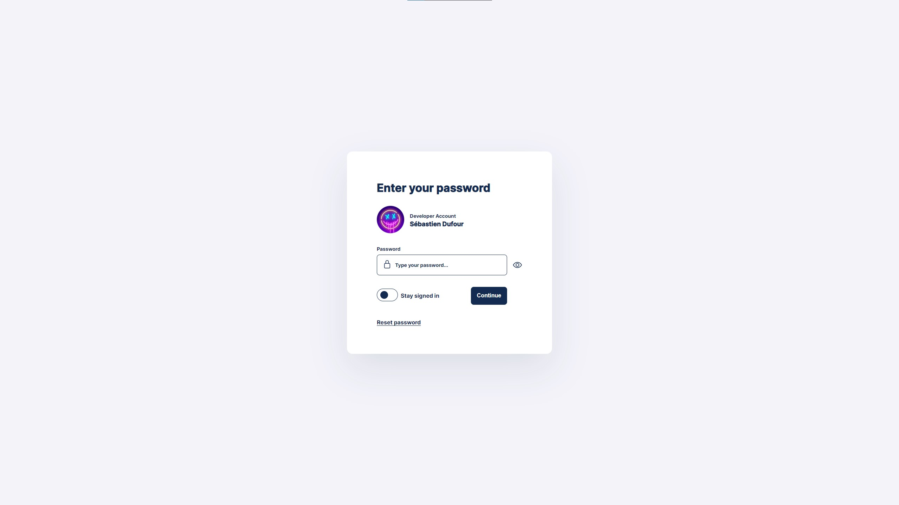

# Find the design here :

https://uidesigndaily.com/posts/figma-enter-password-log-in-authentication-card-day-1583

# Research for this project

To create the show/hide the password :

How to change input type with javascript : https://stackoverflow.com/questions/9093992/change-html-form-input-type-by-javascript

Toggle in javascript : https://www.developerhelps.com/toggle-in-javascript/

# Images

Model :

Result :

# Result

https://sebastien62400.github.io/sign-in-css-training-1/

# Informations

I've not making the responsive because it was not my goal in the project, I'll make it in other projects.
